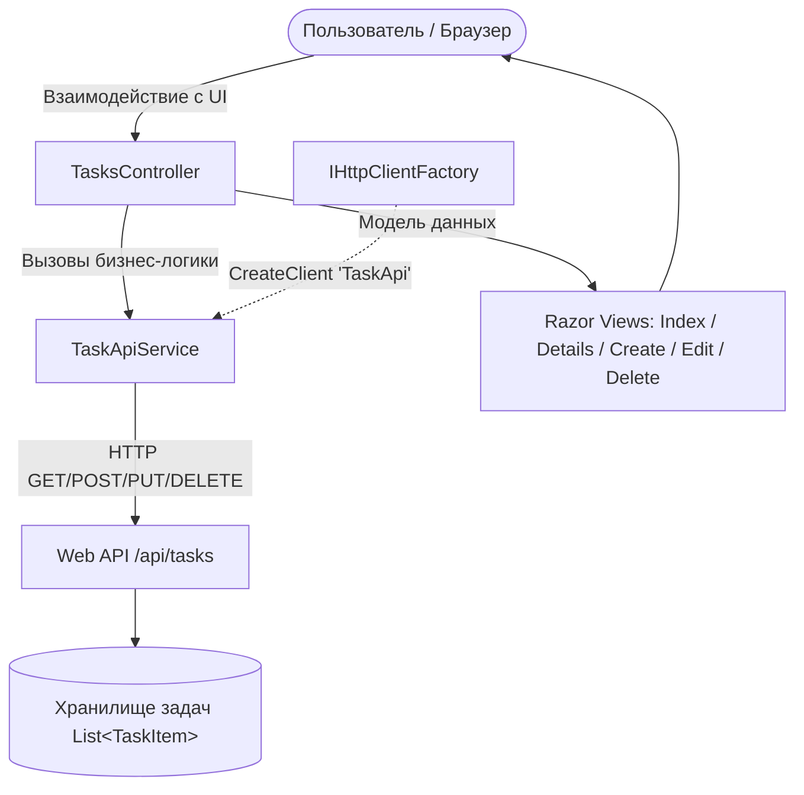

# Домашнее задание 05 (СРС): Клиентское приложение ASP.NET Core для управления задачами (TaskManagerClient)

## Описание проекта
**TaskManagerClient** — это клиентское веб-приложение на ASP.NET Core MVC для управления списком задач, взаимодействующее с внешним Web API посредством `HttpClient` и `IHttpClientFactory`. Приложение реализует полноценные CRUD-операции, обработку кодов состояний HTTP (`200 OK`, `201 Created`, `400 Bad Request`, `404 Not Found`, `500 Internal Server Error`) и сценарий безопасного удаления с подтверждением пользователя.

---

## Архитектура приложения

### Схема взаимодействия
```text
Пользователь (Браузер)
         │
         ▼
TasksController (MVC)
         │
         ├──► ITaskApiService (TaskApiService)
         │           │
         │           ▼
         │     IHttpClientFactory.CreateClient("TaskApi")
         │           │ (HTTP GET/POST/PUT/DELETE)
         │           ▼
         │     Web API (/api/tasks)
         │           │
         │           ▼
         │     Хранилище задач (List<TaskItem>)
         │
         └──► Razor Views (Index, Details, Create, Edit, Delete)
```



---

## Использование `IHttpClientFactory`

В приложении исключено ручное создание `new HttpClient()`, что защищает систему от исчерпания сокетов (`Socket Exhaustion`) и гарантирует своевременное обновление DNS-записей.

1. **Регистрация именованного клиента в `Program.cs`:**
   ```csharp
   builder.Services.AddHttpClient("TaskApi", client =>
   {
       var baseAddress = builder.Configuration["ApiSettings:BaseAddress"] ?? "http://localhost:5000/";
       client.BaseAddress = new Uri(baseAddress);
       client.DefaultRequestHeaders.Add("Accept", "application/json");
   });
   ```

2. **Получение клиента в сервисе `TaskApiService`:**
   ```csharp
   public class TaskApiService : ITaskApiService
   {
       private readonly IHttpClientFactory _httpClientFactory;

       public TaskApiService(IHttpClientFactory httpClientFactory)
       {
           _httpClientFactory = httpClientFactory;
       }

       private HttpClient CreateClient() => _httpClientFactory.CreateClient("TaskApi");
       // ...
   }
   ```

---

## Адрес Web API и перечень реализованных HTTP-методов

* **Базовый адрес API:** `http://localhost:5000/api/tasks`

| HTTP Метод | URL | Описание операции | Коды ответов |
|---|---|---|---|
| `GET` | `/api/tasks` | Получение списка всех задач | `200 OK` |
| `GET` | `/api/tasks/{id}` | Получение одной задачи по её Id | `200 OK`, `404 Not Found` |
| `POST` | `/api/tasks` | Добавление новой задачи | `201 Created`, `400 Bad Request` |
| `PUT` | `/api/tasks/{id}` | Изменение названия, описания и статуса задачи | `200 OK`, `400 Bad Request`, `404 Not Found` |
| `DELETE` | `/api/tasks/{id}` | Удаление задачи (с подтверждением пользователя) | `200 OK`, `404 Not Found` |
| `GET` | `/swagger` | Интерактивная документация Swagger UI | `200 OK` |

---

## Модель данных `TaskItem`

```csharp
public class TaskItem
{
    public int Id { get; set; }
    public string Title { get; set; } = string.Empty;
    public string Description { get; set; } = string.Empty;
    public bool IsCompleted { get; set; }
}
```

| Поле | Тип | Назначение |
|---|---|---|
| `Id` | `int` | Уникальный числовой идентификатор задачи |
| `Title` | `string` | Название задачи |
| `Description` | `string` | Подробное описание задачи |
| `IsCompleted` | `bool` | Признак выполнения (`true` — Выполнено, `false` — В работе) |

---

## Результат работы: Вид списка задач

При открытии приложения отображается таблица следующего вида:

| ID | Название | Статус | Действия |
|---|---|---|---|
| 1 | Изучить HttpClient | **Выполнено** | Инфо / Изменить / Удалить |
| 2 | Реализовать Web API | **В работе** | Инфо / Изменить / Удалить |
| 3 | Изучить PATCH | **В работе** | Инфо / Изменить / Удалить |

В интерфейсе присутствует кнопка **«Добавить задачу»**.

---

## Примеры JSON данных

### 1. Получение всех задач (`GET /api/tasks`)
```json
[
  {
    "id": 1,
    "title": "Изучить HttpClient",
    "description": "Изучить фабрику IHttpClientFactory и работу сокетов",
    "isCompleted": true
  },
  {
    "id": 2,
    "title": "Реализовать Web API",
    "description": "Разработать контроллеры и Swagger документацию",
    "isCompleted": false
  },
  {
    "id": 3,
    "title": "Изучить PATCH",
    "description": "Разобраться с частичным обновлением данных",
    "isCompleted": false
  }
]
```

### 2. Создание задачи (`POST /api/tasks`)
```json
{
  "title": "Настроить Polly для повторных попыток",
  "description": "Добавить политики устойчивости Circuit Breaker",
  "isCompleted": false
}
```

---

## Запуск приложения

```bash
# 1. Собрать проект
dotnet build

# 2. Запустить приложение
dotnet run --project src/TaskManagerClient/TaskManagerClient.csproj
```

* **Веб-интерфейс менеджера задач:** [http://localhost:5000/](http://localhost:5000/)
* **Swagger UI для Web API:** [http://localhost:5000/swagger](http://localhost:5000/swagger)

